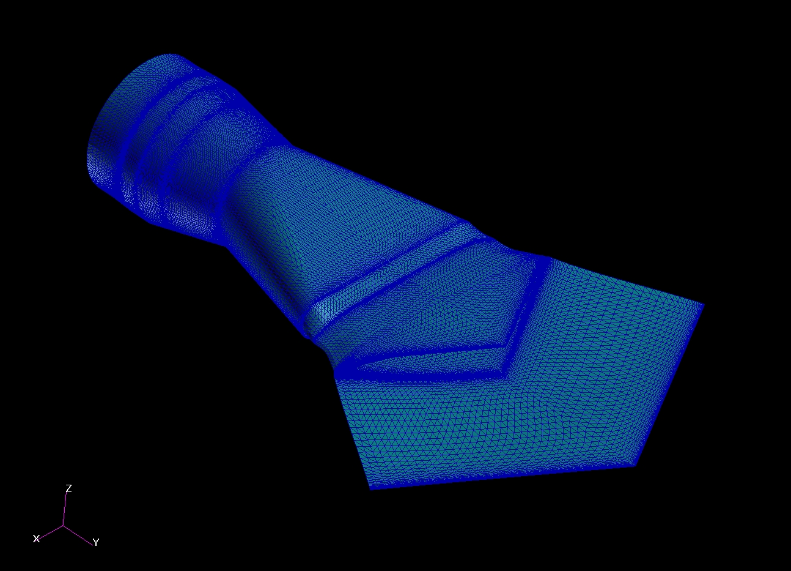
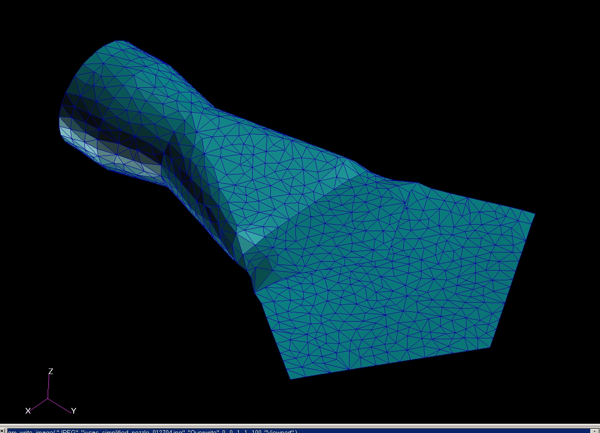

# ========================================
# Utility to Map Node FEM Results From a Fine FEM Mesh to a Simplified FEM Mesh:
# ========================================

## Utility to Map Node FEM Results From a Fine FEM Mesh to a Simplified FEM Mesh.

##
## I. Source Fine FEM Mesh for Which Node Results Exist:

##
## II. Target Simplifed FEM Mesh for Which Node Results Are Desired:

##
## III. Mapping Utility: "./bin/map_mesh.exe"

##
## IV. Mapping Utility Input Files:
### IV.a. "./input/fine_mesh.dat"
### IV.b. "./input/course_mesh.dat"

##
## V. Mapping Utility Output File: "./output/output.bdf"
